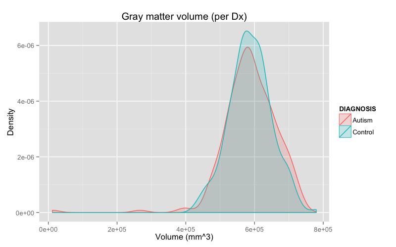
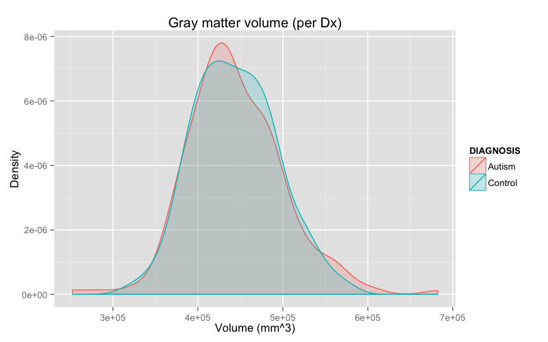
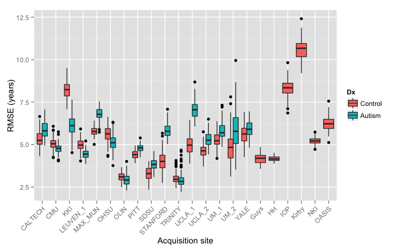

# Demographics

## Preprocessing:  subset and matching

```{r,results = 'asis', echo = T}
results <- read.csv( './Data/labelresultsAnts.csv' )
resultsSubset <- results[which( results$gender == 1 & results$age >= 6 & results$age <= 35 & results$handedness == 'R' ),]
drops <- c( "area.5th.ventricle", "area.left.lesion", "area.right.lesion", "area.left.vessel", "area.right.vessel", "area.optic.chiasm",
"volume.5th.ventricle", "volume.left.lesion", "volume.right.lesion", "volume.left.vessel", "volume.right.vessel", "volume.optic.chiasm",
"jacobian.5th.ventricle", "jacobian.left.lesion", "jacobian.right.lesion", "jacobian.left.vessel", "jacobian.right.vessel", "jacobian.optic.chiasm" )
resultsSubset <- resultsSubset[, !( names( resultsSubset ) %in% drops )]

# match the data based on age and fiq
library( MatchIt )

resultsDf <- data.frame( subject.id = resultsSubset$subject.id,
                         dx.group = resultsSubset$dx.group,
                         age = resultsSubset$age,
                         fiq = resultsSubset$fiq
                       )
resultsDf$dx.group <- as.numeric( resultsDf$dx.group ) - 1
resultsDf <- na.omit( resultsDf )
resultsDf <- match.data( matchit( dx.group ~ age + fiq, data = resultsDf, method = "nearest", discard = "both" ) )

resultsMatched <- resultsSubset[which( is.element( resultsSubset$subject.id, resultsDf$subject.id ) ), ]
write.csv( resultsMatched, './Data/labelresultsANTsSubset.csv', quote = FALSE, row.names = FALSE )
```

## All sites

```{r,results = 'asis', echo = F}
results <- read.csv( './Data/labelresultsAntsSubset.csv' )

numberOfStudies <- nrow( results )
numberOfMales <- length( which( results$gender == 1 ) )
numberOfFemales <- length( which( results$gender == 2 ) )
numberOfAutism <- length( which( results$dx.group == 'Autism' ) )
numberOfControls <- length( which( results$dx.group == 'Control' ) )
numberOfRights <- length( which( results$handedness == 'R' ) )
numberOfLefts <- length( which( results$handedness == 'L' ) )
numberOfAmbis <- length( which( results$handedness == 'Ambi' ) )

cat( "Total number of studies = ", numberOfStudies, "\n\n", sep = '' )
cat( "   males = ", numberOfMales, ", females = ", numberOfFemales, "\n\n", sep = '' )
cat( "  autism = ", numberOfAutism, ", controls = ", numberOfControls, "\n\n", sep = '' )
cat( "  rights = ", numberOfRights, ", lefts = ", numberOfLefts, ", ambis = ", numberOfAmbis, "\n\n", sep = '' )
```

## Age distribution

```{r,results = 'asis', echo = F}
library( ggplot2 )

results <- read.csv( './Data/labelresultsAntsSubset.csv' )

ageDiagnosisDf <- data.frame( AGE = results$age, DIAGNOSIS = results$dx.group )

png( filename = "./Figures/ageDistribution.png", width = 8, height = 5, units = "in", res = 100 )
diagnosisPlot <- ggplot( ageDiagnosisDf, aes( AGE, ..density.., colour = DIAGNOSIS, fill = DIAGNOSIS ) ) +
labs( x = "Age", y = "Density", title = "Age distribution (per Dx)" ) +
geom_density( alpha = 0.2 )
print( diagnosisPlot )
x <- dev.off()
```


# Gross results


## Brain volume distribution

```{r,results = 'asis', echo = F}
library( ggplot2 )

results <- read.csv( './Data/labelresultsAntsSubset.csv' )

tivDiagnosisDf <- data.frame( TIV = results$total.volume, DIAGNOSIS = results$dx.group )

png( filename = "./Figures/tivDistribution.png", width = 8, height = 5, units = "in", res = 100 )
diagnosisPlot <- ggplot( tivDiagnosisDf, aes( TIV, ..density.., colour = DIAGNOSIS, fill = DIAGNOSIS ) ) +
labs( x = "Volume (mm^3)", y = "Density", title = "Intracranial volume (per Dx)" ) +
geom_density( alpha = 0.2 )
print( diagnosisPlot )
x <- dev.off()
```


## CSF volume distribution

```{r,results = 'asis', echo = F}
library( ggplot2 )

results <- read.csv( './Data/labelresultsAntsSubset.csv' )

csfDiagnosisDf <- data.frame( CSF = results$csf.volume, DIAGNOSIS = results$dx.group )

png( filename = "./Figures/csfDistribution.png", width = 8, height = 5, units = "in", res = 100 )
diagnosisPlot <- ggplot( csfDiagnosisDf, aes( CSF, ..density.., colour = DIAGNOSIS, fill = DIAGNOSIS ) ) +
labs( x = "Volume (mm^3)", y = "Density", title = "CSF volume (per Dx)" ) +
geom_density( alpha = 0.2 )
print( diagnosisPlot )
x <- dev.off()
```


## Gray matter volume distribution

```{r,results = 'asis', echo = F}
library( ggplot2 )

results <- read.csv( './Data/labelresultsAntsSubset.csv' )

gmDiagnosisDf <- data.frame( GM = results$gray.matter.volume, DIAGNOSIS = results$dx.group )

png( filename = "./Figures/gmDistribution.png", width = 8, height = 5, units = "in", res = 100 )
diagnosisPlot <- ggplot( gmDiagnosisDf, aes( GM, ..density.., colour = DIAGNOSIS, fill = DIAGNOSIS ) ) +
labs( x = "Volume (mm^3)", y = "Density", title = "Gray matter volume (per Dx)" ) +
geom_density( alpha = 0.2 )
print( diagnosisPlot )
x <- dev.off()
```



## White matter volume distribution

```{r,results = 'asis', echo = F}
library( ggplot2 )

results <- read.csv( './Data/labelresultsAntsSubset.csv' )

wmDiagnosisDf <- data.frame( WM = results$white.matter.volume, DIAGNOSIS = results$dx.group )

png( filename = "./Figures/wmDistribution.png", width = 8, height = 5, units = "in", res = 100 )
diagnosisPlot <- ggplot( wmDiagnosisDf, aes( WM, ..density.., colour = DIAGNOSIS, fill = DIAGNOSIS ) ) +
labs( x = "Volume (mm^3)", y = "Density", title = "Gray matter volume (per Dx)" ) +
geom_density( alpha = 0.2 )
print( diagnosisPlot )
x <- dev.off()
```



## Deep gray matter volume distribution

```{r,results = 'asis', echo = F}
library( ggplot2 )

results <- read.csv( './Data/labelresultsAntsSubset.csv' )

dgmDiagnosisDf <- data.frame( DGM = results$deep.gray.matter.volume, DIAGNOSIS = results$dx.group )

png( filename = "./Figures/dgmDistribution.png", width = 8, height = 5, units = "in", res = 100 )
diagnosisPlot <- ggplot( dgmDiagnosisDf, aes( DGM, ..density.., colour = DIAGNOSIS, fill = DIAGNOSIS ) ) +
labs( x = "Volume (mm^3)", y = "Density", title = "Deep gray matter volume (per Dx)" ) +
geom_density( alpha = 0.2 )
print( diagnosisPlot )
x <- dev.off()
```


## Total mean thickness distribution

```{r,results = 'asis', echo = F}
library( ggplot2 )

results <- read.csv( './Data/labelresultsAntsSubset.csv' )

thickDiagnosisDf <- data.frame( THICKNESS = results$total.mean.thickness, DIAGNOSIS = results$dx.group )

png( filename = "./Figures/totalMeanThicknessDistribution.png", width = 8, height = 5, units = "in", res = 100 )
diagnosisPlot <- ggplot( thickDiagnosisDf, aes( THICKNESS, ..density.., colour = DIAGNOSIS, fill = DIAGNOSIS ) ) +
labs( x = "Thickness (mm)", y = "Density", title = "Total mean thickness (per Dx)" ) +
geom_density( alpha = 0.2 )
print( diagnosisPlot )
x <- dev.off()
```


# Per site demographics

## Site demographics

```{r,results = 'asis', echo = F}
results <- read.csv( './Data/labelresultsAntsSubset.csv' )

numberOfStudies <- nrow( results )

count <- 0
for( q in levels( results$site ) )
  {
  count <- count + 1
  if( count <= 10 )
    {
    resultsSite <- results[which( results$site == q ),]
    cat( "  \n  ", q, ": n = " , nrow( resultsSite ), sep = '' )
    numberOfMales <- length( which( resultsSite$gender == 1 ) )
    numberOfFemales <- length( which( resultsSite$gender == 2 ) )
    cat( " (males = ", numberOfMales, ", females = ", numberOfFemales, ")", sep = '' )
    }
  }

```

## Site demographics (continued)

```{r,results = 'asis', echo = F}
results <- read.csv( './Data/labelresultsAntsSubset.csv' )

numberOfStudies <- nrow( results )

count <- 0
for( q in levels( results$site ) )
  {
  count <- count + 1
  if( count > 10 )
    {
    resultsSite <- results[which( results$site == q ),]
    cat( "  \n  ", q, ": n = " , nrow( resultsSite ), sep = '' )
    numberOfMales <- length( which( resultsSite$gender == 1 ) )
    numberOfFemales <- length( which( resultsSite$gender == 2 ) )
    cat( " (males = ", numberOfMales, ", females = ", numberOfFemales, ")", sep = '' )
    }
  }

```

## Age

```{r,results = 'asis', echo = F}
library( ggplot2 )

results <- read.csv( './Data/labelresultsAntsSubset.csv' )

ageDiagnosisDf <- data.frame( AGE = results$age, DIAGNOSIS = results$dx.group, SITE = results$site )

png( filename = "./Figures/siteAgeDistribution.png", width = 8, height = 5, units = "in", res = 100 )
diagnosisBoxPlot <- ggplot( ageDiagnosisDf, aes( x = SITE, y = AGE ) ) +
geom_boxplot( aes( fill = DIAGNOSIS ) ) +
scale_x_discrete( "Acquisition site", labels = levels( results$site ) ) +
scale_y_continuous( "Age" ) +
theme( axis.text.x = element_text( angle = 45, hjust = 1 ) )
print( diagnosisBoxPlot )
x <- dev.off()
```


# Per site gross results

## Brain volume

```{r,results = 'asis', echo = F}
library( ggplot2 )

results <- read.csv( './Data/labelresultsAntsSubset.csv' )

tivDiagnosisDf <- data.frame( TIV = results$total.volume, DIAGNOSIS = results$dx.group, SITE = results$site )

png( filename = "./Figures/siteVolumeDistribution.png", width = 8, height = 5, units = "in", res = 100 )
diagnosisBoxPlot <- ggplot( tivDiagnosisDf, aes( x = SITE, y = TIV ) ) +
geom_boxplot( aes( fill = DIAGNOSIS ) ) +
scale_x_discrete( "Acquisition site", labels = levels( results$site ) ) +
scale_y_continuous( "Brain volume (mm^3)" ) +
theme( axis.text.x = element_text( angle = 45, hjust = 1 ) )
print( diagnosisBoxPlot )
x <- dev.off()
```


## CSF volume

```{r,results = 'asis', echo = F}
library( ggplot2 )

results <- read.csv( './Data/labelresultsAntsSubset.csv' )

csfDiagnosisDf <- data.frame( CSF = results$csf.volume, DIAGNOSIS = results$dx.group, SITE = results$site )

png( filename = "./Figures/siteCsfVolumeDistribution.png", width = 8, height = 5, units = "in", res = 100 )
diagnosisBoxPlot <- ggplot( csfDiagnosisDf, aes( x = SITE, y = CSF ) ) +
geom_boxplot( aes( fill = DIAGNOSIS ) ) +
scale_x_discrete( "Acquisition site", labels = levels( results$site ) ) +
scale_y_continuous( "Csf volume (mm^3)" ) +
theme( axis.text.x = element_text( angle = 45, hjust = 1 ) )
print( diagnosisBoxPlot )
x <- dev.off()
```


## Gray matter volume

```{r,results = 'asis', echo = F}
library( ggplot2 )

results <- read.csv( './Data/labelresultsAntsSubset.csv' )

gmDiagnosisDf <- data.frame( GM = results$gray.matter.volume, DIAGNOSIS = results$dx.group, SITE = results$site )

png( filename = "./Figures/siteGmVolumeDistribution.png", width = 8, height = 5, units = "in", res = 100 )
diagnosisBoxPlot <- ggplot( gmDiagnosisDf, aes( x = SITE, y = GM ) ) +
geom_boxplot( aes( fill = DIAGNOSIS ) ) +
scale_x_discrete( "Acquisition site", labels = levels( results$site ) ) +
scale_y_continuous( "Gray matter volume (mm^3)" ) +
theme( axis.text.x = element_text( angle = 45, hjust = 1 ) )
print( diagnosisBoxPlot )
x <- dev.off()
```


## White matter volume

```{r,results = 'asis', echo = F}
library( ggplot2 )

results <- read.csv( './Data/labelresultsAntsSubset.csv' )

wmDiagnosisDf <- data.frame( WM = results$white.matter.volume, DIAGNOSIS = results$dx.group, SITE = results$site )

png( filename = "./Figures/siteWmVolumeDistribution.png", width = 8, height = 5, units = "in", res = 100 )
diagnosisBoxPlot <- ggplot( wmDiagnosisDf, aes( x = SITE, y = WM ) ) +
geom_boxplot( aes( fill = DIAGNOSIS ) ) +
scale_x_discrete( "Acquisition site", labels = levels( results$site ) ) +
scale_y_continuous( "White matter volume (mm^3)" ) +
theme( axis.text.x = element_text( angle = 45, hjust = 1 ) )
print( diagnosisBoxPlot )
x <- dev.off()
```


## Deep gray matter volume

```{r,results = 'asis', echo = F}
library( ggplot2 )

results <- read.csv( './Data/labelresultsAntsSubset.csv' )

dgmDiagnosisDf <- data.frame( DGM = results$deep.gray.matter.volume, DIAGNOSIS = results$dx.group, SITE = results$site )

png( filename = "./Figures/siteDgmVolumeDistribution.png", width = 8, height = 5, units = "in", res = 100 )
diagnosisBoxPlot <- ggplot( dgmDiagnosisDf, aes( x = SITE, y = DGM ) ) +
geom_boxplot( aes( fill = DIAGNOSIS ) ) +
scale_x_discrete( "Acquisition site", labels = levels( results$site ) ) +
scale_y_continuous( "Deep gray matter volume (mm^3)" ) +
theme( axis.text.x = element_text( angle = 45, hjust = 1 ) )
print( diagnosisBoxPlot )
x <- dev.off()
```


## Total mean thickness

```{r,results = 'asis', echo = F}
library( ggplot2 )

results <- read.csv( './Data/labelresultsAntsSubset.csv' )

thDiagnosisDf <- data.frame( TH = results$total.mean.thickness, DIAGNOSIS = results$dx.group, SITE = results$site )

png( filename = "./Figures/siteThVolumeDistribution.png", width = 8, height = 5, units = "in", res = 100 )
diagnosisBoxPlot <- ggplot( thDiagnosisDf, aes( x = SITE, y = TH ) ) +
geom_boxplot( aes( fill = DIAGNOSIS ) ) +
scale_x_discrete( "Acquisition site", labels = levels( results$site ) ) +
scale_y_continuous( "Total mean thickness (mm)" ) +
theme( axis.text.x = element_text( angle = 45, hjust = 1 ) )
print( diagnosisBoxPlot )
x <- dev.off()
```


# Paper results

# Results:  Intracranial volume

## All site results:  Intracranial volume

```{r,results = 'asis', echo = T}
library( xtable )
results <- read.csv( './Data/labelresultsAntsSubset.csv' )
fit <- aov( total.volume ~ dx.group + site + age + fiq, data = results )
print( xtable( anova( fit ) ), type = "html" )
```

## Per site results:  Intracranial volume

`total.volume ~ dx.group + age + fiq`

```{r,results = 'asis', echo = F}
library( xtable )
results <- read.csv( './Data/labelresultsAntsSubset.csv' )
significance <- data.frame( site = character(), dx.Pvalue = numeric(),
  age.Pvalue = numeric(), fiq.Pvalue = numeric(), stringsAsFactors = TRUE )

count <- 0
for( site in levels( results$site ) )
  {
  if( count < 8 )
    {
    resultsPerSite <- results[which( results$site == site ),]
    fit <- anova( aov( total.volume ~ dx.group + age + fiq, data = resultsPerSite ) )
    sig <- data.frame( site = site, dx.Pvalue = fit[,5][1], age.Pvalue = fit[,5][2], fiq.Pvalue = fit[,5][3] )
    significance <- rbind( significance, sig )
    }
  count <- count + 1
  }
print( xtable( significance ), type = "html", include.rownames = FALSE )
```

## Per site results (cont.):  Intracranial volume

`total.volume ~ dx.group + age + fiq`

```{r,results = 'asis', echo = F}
library( xtable )
results <- read.csv( './Data/labelresultsAntsSubset.csv' )
significance <- data.frame( site = character(), dx.Pvalue = numeric(),
age.Pvalue = numeric(), fiq.Pvalue = numeric(), stringsAsFactors = TRUE )

count <- 0
for( site in levels( results$site ) )
  {
  if( count >= 8 )
    {
    resultsPerSite <- results[which( results$site == site ),]
    fit <- anova( aov( total.volume ~ dx.group + age + fiq, data = resultsPerSite ) )
    sig <- data.frame( site = site, dx.Pvalue = fit[,5][1], age.Pvalue = fit[,5][2], fiq.Pvalue = fit[,5][3] )
    significance <- rbind( significance, sig )
    }
  count <- count + 1
  }
print( xtable( significance ), type = "html", include.rownames = FALSE )
```

# Results:  Amygdala volume

## All site results:  Amygdala volume (right)

```{r,results = 'asis', echo = T}
library( xtable )
results <- read.csv( './Data/labelresultsAntsSubset.csv' )
fit <- aov( volume.right.amygdala ~ dx.group + site + age + fiq, data = results )
print( xtable( anova( fit ) ), type = "html" )
```

## Per site results:  Amygdala volume (right)

`volume.right.amygdala ~ dx.group + age + fiq`

```{r,results = 'asis', echo = F}
library( xtable )
results <- read.csv( './Data/labelresultsAntsSubset.csv' )
significance <- data.frame( site = character(), dx.Pvalue = numeric(),
age.Pvalue = numeric(), fiq.Pvalue = numeric(), stringsAsFactors = TRUE )

count <- 0
for( site in levels( results$site ) )
{
 if( count < 8 )
 {
  resultsPerSite <- results[which( results$site == site ),]
  fit <- anova( aov( volume.right.amygdala ~ dx.group + age + fiq, data = resultsPerSite ) )
  sig <- data.frame( site = site, dx.Pvalue = fit[,5][1], age.Pvalue = fit[,5][2], fiq.Pvalue = fit[,5][3] )
  significance <- rbind( significance, sig )
 }
 count <- count + 1
}
print( xtable( significance ), type = "html", include.rownames = FALSE )
```

## Per site results (cont.):  Amygdala volume (right)

`volume.right.amygdala ~ dx.group + age + fiq`

```{r,results = 'asis', echo = F}
library( xtable )
results <- read.csv( './Data/labelresultsAntsSubset.csv' )
significance <- data.frame( site = character(), dx.Pvalue = numeric(),
age.Pvalue = numeric(), fiq.Pvalue = numeric(), stringsAsFactors = TRUE )

count <- 0
for( site in levels( results$site ) )
{
 if( count >= 8 )
 {
  resultsPerSite <- results[which( results$site == site ),]
  fit <- anova( aov( volume.right.amygdala ~ dx.group + age + fiq, data = resultsPerSite ) )
  sig <- data.frame( site = site, dx.Pvalue = fit[,5][1], age.Pvalue = fit[,5][2], fiq.Pvalue = fit[,5][3] )
  significance <- rbind( significance, sig )
 }
 count <- count + 1
}
print( xtable( significance ), type = "html", include.rownames = FALSE )
```

## All site results:  Amygdala volume (left)

```{r,results = 'asis', echo = T}
library( xtable )
results <- read.csv( './Data/labelresultsAntsSubset.csv' )
fit <- aov( volume.left.amygdala ~ dx.group + site + age + fiq, data = results )
print( xtable( anova( fit ) ), type = "html" )
```

## Per site results:  Amygdala volume (left)

`volume.left.amygdala ~ dx.group + age + fiq`

```{r,results = 'asis', echo = F}
library( xtable )
results <- read.csv( './Data/labelresultsAntsSubset.csv' )
significance <- data.frame( site = character(), dx.Pvalue = numeric(),
age.Pvalue = numeric(), fiq.Pvalue = numeric(), stringsAsFactors = TRUE )

count <- 0
for( site in levels( results$site ) )
{
 if( count < 8 )
 {
  resultsPerSite <- results[which( results$site == site ),]
  fit <- anova( aov( volume.left.amygdala ~ dx.group + age + fiq, data = resultsPerSite ) )
  sig <- data.frame( site = site, dx.Pvalue = fit[,5][1], age.Pvalue = fit[,5][2], fiq.Pvalue = fit[,5][3] )
  significance <- rbind( significance, sig )
 }
 count <- count + 1
}
print( xtable( significance ), type = "html", include.rownames = FALSE )
```

## Per site results (cont.):  Amygdala volume (left)

`volume.left.amygdala ~ dx.group + age + fiq`

```{r,results = 'asis', echo = F}
library( xtable )
results <- read.csv( './Data/labelresultsAntsSubset.csv' )
significance <- data.frame( site = character(), dx.Pvalue = numeric(),
age.Pvalue = numeric(), fiq.Pvalue = numeric(), stringsAsFactors = TRUE )

count <- 0
for( site in levels( results$site ) )
{
 if( count >= 8 )
 {
  resultsPerSite <- results[which( results$site == site ),]
  fit <- anova( aov( volume.left.amygdala ~ dx.group + age + fiq, data = resultsPerSite ) )
  sig <- data.frame( site = site, dx.Pvalue = fit[,5][1], age.Pvalue = fit[,5][2], fiq.Pvalue = fit[,5][3] )
  significance <- rbind( significance, sig )
 }
 count <- count + 1
}
print( xtable( significance ), type = "html", include.rownames = FALSE )
```


# Results:  CSF volume

## All sites:  CSF volume

```{r,results = 'asis', echo = T}
library( xtable )
results <- read.csv( './Data/labelresultsAntsSubset.csv' )
fit <- aov( csf.volume ~ dx.group + site + age + fiq, data = results )
print( xtable( anova( fit ) ), type = "html" )
```

## Per site results:  CSF volume

`csf.volume ~ dx.group + age + fiq`

```{r,results = 'asis', echo = F}
library( xtable )
results <- read.csv( './Data/labelresultsAntsSubset.csv' )
significance <- data.frame( site = character(), dx.Pvalue = numeric(),
age.Pvalue = numeric(), fiq.Pvalue = numeric(), stringsAsFactors = TRUE )

count <- 0
for( site in levels( results$site ) )
{
 if( count < 8 )
 {
  resultsPerSite <- results[which( results$site == site ),]
  fit <- anova( aov( csf.volume ~ dx.group + age + fiq, data = resultsPerSite ) )
  sig <- data.frame( site = site, dx.Pvalue = fit[,5][1], age.Pvalue = fit[,5][2], fiq.Pvalue = fit[,5][3] )
  significance <- rbind( significance, sig )
 }
 count <- count + 1
}
print( xtable( significance ), type = "html", include.rownames = FALSE )
```

## Per site results (cont.):  CSF volume

`csf.volume ~ dx.group + age + fiq`

```{r,results = 'asis', echo = F}
library( xtable )
results <- read.csv( './Data/labelresultsAntsSubset.csv' )
significance <- data.frame( site = character(), dx.Pvalue = numeric(),
age.Pvalue = numeric(), fiq.Pvalue = numeric(), stringsAsFactors = TRUE )

count <- 0
for( site in levels( results$site ) )
{
 if( count >= 8 )
 {
  resultsPerSite <- results[which( results$site == site ),]
  fit <- anova( aov( csf.volume ~ dx.group + age + fiq, data = resultsPerSite ) )
  sig <- data.frame( site = site, dx.Pvalue = fit[,5][1], age.Pvalue = fit[,5][2], fiq.Pvalue = fit[,5][3] )
  significance <- rbind( significance, sig )
 }
 count <- count + 1
}
print( xtable( significance ), type = "html", include.rownames = FALSE )
```

# Results:  Gray matter volume

## All sites:  Gray matter volume

```{r,results = 'asis', echo = T}
library( xtable )
results <- read.csv( './Data/labelresultsAntsSubset.csv' )
fit <- aov( gray.matter.volume ~ dx.group + site + age + fiq, data = results )
print( xtable( anova( fit ) ), type = "html" )
```

## Per site results:  Gray matter volume

`gray.matter.volume ~ dx.group + age + fiq`

```{r,results = 'asis', echo = F}
library( xtable )
results <- read.csv( './Data/labelresultsAntsSubset.csv' )
significance <- data.frame( site = character(), dx.Pvalue = numeric(),
age.Pvalue = numeric(), fiq.Pvalue = numeric(), stringsAsFactors = TRUE )

count <- 0
for( site in levels( results$site ) )
{
 if( count < 8 )
 {
  resultsPerSite <- results[which( results$site == site ),]
  fit <- anova( aov( gray.matter.volume ~ dx.group + age + fiq, data = resultsPerSite ) )
  sig <- data.frame( site = site, dx.Pvalue = fit[,5][1], age.Pvalue = fit[,5][2], fiq.Pvalue = fit[,5][3] )
  significance <- rbind( significance, sig )
 }
 count <- count + 1
}
print( xtable( significance ), type = "html", include.rownames = FALSE )
```

## Per site results (cont.):  Gray matter volume

`gray.matter.volume ~ dx.group + age + fiq`

```{r,results = 'asis', echo = F}
library( xtable )
results <- read.csv( './Data/labelresultsAntsSubset.csv' )
significance <- data.frame( site = character(), dx.Pvalue = numeric(),
age.Pvalue = numeric(), fiq.Pvalue = numeric(), stringsAsFactors = TRUE )

count <- 0
for( site in levels( results$site ) )
{
 if( count >= 8 )
 {
  resultsPerSite <- results[which( results$site == site ),]
  fit <- anova( aov( gray.matter.volume ~ dx.group + age + fiq, data = resultsPerSite ) )
  sig <- data.frame( site = site, dx.Pvalue = fit[,5][1], age.Pvalue = fit[,5][2], fiq.Pvalue = fit[,5][3] )
  significance <- rbind( significance, sig )
 }
 count <- count + 1
}
print( xtable( significance ), type = "html", include.rownames = FALSE )
```


# Results:  White matter volume

## All sites:  White matter volume

```{r,results = 'asis', echo = T}
library( xtable )
results <- read.csv( './Data/labelresultsAntsSubset.csv' )
fit <- aov( white.matter.volume ~ dx.group + site + age + fiq, data = results )
print( xtable( anova( fit ) ), type = "html" )
```

## Per site results:  White matter volume

`white.matter.volume ~ dx.group + age + fiq`

```{r,results = 'asis', echo = F}
library( xtable )
results <- read.csv( './Data/labelresultsAntsSubset.csv' )
significance <- data.frame( site = character(), dx.Pvalue = numeric(),
age.Pvalue = numeric(), fiq.Pvalue = numeric(), stringsAsFactors = TRUE )

count <- 0
for( site in levels( results$site ) )
{
 if( count < 8 )
 {
  resultsPerSite <- results[which( results$site == site ),]
  fit <- anova( aov( white.matter.volume ~ dx.group + age + fiq, data = resultsPerSite ) )
  sig <- data.frame( site = site, dx.Pvalue = fit[,5][1], age.Pvalue = fit[,5][2], fiq.Pvalue = fit[,5][3] )
  significance <- rbind( significance, sig )
 }
 count <- count + 1
}
print( xtable( significance ), type = "html", include.rownames = FALSE )
```

## Per site results (cont.):  White matter volume

`white.matter.volume ~ dx.group + age + fiq`

```{r,results = 'asis', echo = F}
library( xtable )
results <- read.csv( './Data/labelresultsAntsSubset.csv' )
significance <- data.frame( site = character(), dx.Pvalue = numeric(),
age.Pvalue = numeric(), fiq.Pvalue = numeric(), stringsAsFactors = TRUE )

count <- 0
for( site in levels( results$site ) )
{
 if( count >= 8 )
 {
  resultsPerSite <- results[which( results$site == site ),]
  fit <- anova( aov( white.matter.volume ~ dx.group + age + fiq, data = resultsPerSite ) )
  sig <- data.frame( site = site, dx.Pvalue = fit[,5][1], age.Pvalue = fit[,5][2], fiq.Pvalue = fit[,5][3] )
  significance <- rbind( significance, sig )
 }
 count <- count + 1
}
print( xtable( significance ), type = "html", include.rownames = FALSE )
```


# Results:  Deep gray matter volume

## All sites:  Deep gray matter volume

```{r,results = 'asis', echo = T}
library( xtable )
results <- read.csv( './Data/labelresultsAntsSubset.csv' )
fit <- aov( deep.gray.matter.volume ~ dx.group + site + age + fiq, data = results )
print( xtable( anova( fit ) ), type = "html" )
```

## Per site results:  Deep gray matter volume

`deep.gray.matter.volume ~ dx.group + age + fiq`

```{r,results = 'asis', echo = F}
library( xtable )
results <- read.csv( './Data/labelresultsAntsSubset.csv' )
significance <- data.frame( site = character(), dx.Pvalue = numeric(),
age.Pvalue = numeric(), fiq.Pvalue = numeric(), stringsAsFactors = TRUE )

count <- 0
for( site in levels( results$site ) )
{
 if( count < 8 )
 {
  resultsPerSite <- results[which( results$site == site ),]
  fit <- anova( aov( deep.gray.matter.volume ~ dx.group + age + fiq, data = resultsPerSite ) )
  sig <- data.frame( site = site, dx.Pvalue = fit[,5][1], age.Pvalue = fit[,5][2], fiq.Pvalue = fit[,5][3] )
  significance <- rbind( significance, sig )
 }
 count <- count + 1
}
print( xtable( significance ), type = "html", include.rownames = FALSE )
```

## Per site results (cont.):  Deep gray matter volume

`deep.gray.matter.volume ~ dx.group + age + fiq`

```{r,results = 'asis', echo = F}
library( xtable )
results <- read.csv( './Data/labelresultsAntsSubset.csv' )
significance <- data.frame( site = character(), dx.Pvalue = numeric(),
age.Pvalue = numeric(), fiq.Pvalue = numeric(), stringsAsFactors = TRUE )

count <- 0
for( site in levels( results$site ) )
{
 if( count >= 8 )
 {
  resultsPerSite <- results[which( results$site == site ),]
  fit <- anova( aov( deep.gray.matter.volume ~ dx.group + age + fiq, data = resultsPerSite ) )
  sig <- data.frame( site = site, dx.Pvalue = fit[,5][1], age.Pvalue = fit[,5][2], fiq.Pvalue = fit[,5][3] )
  significance <- rbind( significance, sig )
 }
 count <- count + 1
}
print( xtable( significance ), type = "html", include.rownames = FALSE )
```


# Results:  Total mean thickness

## All sites:  Total mean thickness

```{r,results = 'asis', echo = T}
library( xtable )
results <- read.csv( './Data/labelresultsAntsSubset.csv' )
fit <- aov( total.mean.thickness ~ dx.group + site + age + fiq, data = results )
print( xtable( anova( fit ) ), type = "html" )
```

## Per site results:  Total mean thickness

`total.mean.thickness ~ dx.group + age + fiq`

```{r,results = 'asis', echo = F}
library( xtable )
results <- read.csv( './Data/labelresultsAntsSubset.csv' )
significance <- data.frame( site = character(), dx.Pvalue = numeric(),
age.Pvalue = numeric(), fiq.Pvalue = numeric(), stringsAsFactors = TRUE )

count <- 0
for( site in levels( results$site ) )
{
 if( count < 8 )
 {
  resultsPerSite <- results[which( results$site == site ),]
  fit <- anova( aov( total.mean.thickness ~ dx.group + age + fiq, data = resultsPerSite ) )
  sig <- data.frame( site = site, dx.Pvalue = fit[,5][1], age.Pvalue = fit[,5][2], fiq.Pvalue = fit[,5][3] )
  significance <- rbind( significance, sig )
 }
 count <- count + 1
}
print( xtable( significance ), type = "html", include.rownames = FALSE )
```

## Per site results (cont.):  Total mean thickness

`total.mean.thickness ~ dx.group + age + fiq`

```{r,results = 'asis', echo = F}
library( xtable )
results <- read.csv( './Data/labelresultsAntsSubset.csv' )
significance <- data.frame( site = character(), dx.Pvalue = numeric(),
age.Pvalue = numeric(), fiq.Pvalue = numeric(), stringsAsFactors = TRUE )

count <- 0
for( site in levels( results$site ) )
{
 if( count >= 8 )
 {
  resultsPerSite <- results[which( results$site == site ),]
  fit <- anova( aov( total.mean.thickness ~ dx.group + age + fiq, data = resultsPerSite ) )
  sig <- data.frame( site = site, dx.Pvalue = fit[,5][1], age.Pvalue = fit[,5][2], fiq.Pvalue = fit[,5][3] )
  significance <- rbind( significance, sig )
 }
 count <- count + 1
}
print( xtable( significance ), type = "html", include.rownames = FALSE )
```

# New stuff
# QA/QC


#

## Is site predictive of diagnosis?

```{r,results = 'asis', echo = F}
library( xtable )
results <- read.csv( './Data/labelresultsAntsSubset.csv' )
fit <- summary( glm( dx.group ~ site, data = results, family = binomial ) )
fitDataFrame <- data.frame( garbageName = fit$coefficients[,4] )
colnames( fitDataFrame )[1] <- "Pr(>|z|)"
print( xtable( fitDataFrame ), type = "html" )
```

## Age prediction of controls:  Thickness

```{r,results = 'asis', echo = F}

if( 0 )
{

###################################################################################################
#
#  Get the data including IXI, NKI, Oasis, Kirby
#
###################################################################################################

library( RCurl )

x <- getURL( "https://raw.githubusercontent.com/ntustison/KapowskiChronicles/master/analytics2/labelresultsANTsI.csv" )
resultsIxi <- read.csv( text = x )
resultsIxi <- resultsIxi[which( resultsIxi$SEX == 1 & resultsIxi$AGE >= 6 & resultsIxi$AGE <= 35 ),]
colnames( resultsIxi )[which( names( resultsIxi ) == "ID")] <- "subject.id"
colnames( resultsIxi )[which( names( resultsIxi ) == "AGE")] <- "age"
colnames( resultsIxi )[which( names( resultsIxi ) == "VOLUME")] <- "total.volume"
colnames( resultsIxi )[which( names( resultsIxi ) == "SEX")] <- "gender"
colnames( resultsIxi )[which( names( resultsIxi ) == "SITE")] <- "site"
resultsIxi <- cbind( resultsIxi, rep( "Control", nrow( resultsIxi ) ) )
colnames( resultsIxi )[ncol( resultsIxi )] <- "dx.group"

x <- getURL( "https://raw.githubusercontent.com/ntustison/KapowskiChronicles/master/analytics2/labelresultsANTsO.csv" )
resultsOasis <- read.csv( text = x )
resultsOasis <- resultsOasis[which( resultsOasis$SEX == 1 & resultsOasis$AGE >= 6 & resultsOasis$AGE <= 35 ),]
colnames( resultsOasis )[which( names( resultsOasis ) == "ID")] <- "subject.id"
colnames( resultsOasis )[which( names( resultsOasis ) == "AGE")] <- "age"
colnames( resultsOasis )[which( names( resultsOasis ) == "VOLUME")] <- "total.volume"
colnames( resultsOasis )[which( names( resultsOasis ) == "SEX")] <- "gender"
colnames( resultsOasis )[which( names( resultsOasis ) == "SITE")] <- "site"
resultsOasis <- cbind( resultsOasis, rep( "Control", nrow( resultsOasis ) ) )
colnames( resultsOasis )[ncol( resultsOasis )] <- "dx.group"

x <- getURL( "https://raw.githubusercontent.com/ntustison/KapowskiChronicles/master/analytics2/labelresultsANTsN.csv" )
resultsNki <- read.csv( text = x )
resultsNki <- resultsNki[which( resultsNki$SEX == 1 & resultsNki$AGE >= 6 & resultsNki$AGE <= 35 ),]
colnames( resultsNki )[which( names( resultsNki ) == "ID")] <- "subject.id"
colnames( resultsNki )[which( names( resultsNki ) == "AGE")] <- "age"
colnames( resultsNki )[which( names( resultsNki ) == "VOLUME")] <- "total.volume"
colnames( resultsNki )[which( names( resultsNki ) == "SEX")] <- "gender"
colnames( resultsNki )[which( names( resultsNki ) == "SITE")] <- "site"
resultsNki <- cbind( resultsNki, rep( "Control", nrow( resultsNki ) ) )
colnames( resultsNki )[ncol( resultsNki )] <- "dx.group"

x <- getURL( "https://raw.githubusercontent.com/ntustison/KapowskiChronicles/master/analytics2/labelresultsANTsK.csv" )
resultsKirby <- read.csv( text = x )
resultsKirby <- resultsKirby[which( resultsKirby$SEX == 1 & resultsKirby$AGE >= 6 & resultsKirby$AGE <= 35 ),]
colnames( resultsKirby )[which( names( resultsKirby ) == "ID")] <- "subject.id"
colnames( resultsKirby )[which( names( resultsKirby ) == "AGE")] <- "age"
colnames( resultsKirby )[which( names( resultsKirby ) == "VOLUME")] <- "total.volume"
colnames( resultsKirby )[which( names( resultsKirby ) == "SEX")] <- "gender"
colnames( resultsKirby )[which( names( resultsKirby ) == "SITE")] <- "site"
resultsKirby <- cbind( resultsKirby, rep( "Control", nrow( resultsKirby ) ) )
colnames( resultsKirby )[ncol( resultsKirby )] <- "dx.group"

resultsAbide <- read.csv( './Data/labelresultsAntsSubset.csv' )
resultsAbide <- cbind( resultsAbide$subject.id,
                       resultsAbide$site,
                       resultsAbide$gender,
                       resultsAbide$age,
                       resultsAbide$dx.group,
                       resultsAbide$total.volume,
                       resultsAbide[, grep('^thickness.', names( resultsAbide ) )] )
colnames( resultsAbide )[1:6] <- c( "subject.id", "site", "gender", "age", "dx.group", "total.volume" )
resultsAbide <- resultsAbide[complete.cases( resultsAbide ),]
colnames( resultsAbide ) <- gsub( "thickness.", '', colnames( resultsAbide ) )

resultsAll <- rbind( resultsAbide, resultsIxi, resultsKirby, resultsNki, resultsOasis )
resultsAllControl <- resultsAll[which( resultsAll$dx.group == "Control" ),]
resultsAllAutism <- resultsAll[which( resultsAll$dx.group == "Autism" ),]

###################################################################################################
#
#  Get the data including IXI, NKI, Oasis, Kirby
#
###################################################################################################

library( caret )
library( randomForest )
library( ggplot2 )

nPermutations <- 100
drops <- c( "subject.id", "site", "gender", "dx.group" )

resultsData <- data.frame( Site = character( 0 ), RMSE = numeric( 0 ), Dx = character( 0 ) )

for( site in levels( resultsAllControl$site ) )
  {
  resultsAllControlSiteRemoved <- resultsAllControl[which( resultsAllControl$site != site ),]
  testingDataControls <- resultsAllControl[which( resultsAllControl$site == site ),]
  testingDataControls <- testingDataControls[, !( names( testingDataControls ) %in% drops )]

  resultsAllAutismSiteRemoved <- resultsAllAutism[which( resultsAllAutism$site != site ),]
  testingDataAutism <- resultsAllAutism[which( resultsAllAutism$site == site ),]
  testingDataAutism <- testingDataAutism[, !( names( testingDataAutism ) %in% drops )]

  cat( "Site = ", site, "\n", sep = '' )

  pb <- txtProgressBar( min = 1, max = nPermutations, style = 3 )
  for( p in 1:nPermutations )
    {
    setTxtProgressBar( pb, p )
    trainingIndices <- createDataPartition( resultsAllControlSiteRemoved$site, p = 0.5, list = FALSE )
    trainingData <- resultsAllControlSiteRemoved[trainingIndices,]
    trainingData <- trainingData[, !( names( trainingData ) %in% drops )]

    brainAgeRF <- randomForest( age ~ ., data = trainingData, na.action = na.omit, replace = FALSE, ntree = 200 )

    ## do controls ##

    predictedAge <- predict( brainAgeRF, testingDataControls )
    rmse <- sqrt( mean( ( ( testingDataControls$age - predictedAge )^2 ), na.rm = TRUE ) )
    oneData <- data.frame( Site = site, RMSE = rmse, Dx = rep( "Control", length( rmse ) ) )
    resultsData <- rbind( resultsData, oneData )

    ## do autisms ##

    if( nrow( testingDataAutism ) > 0 )
      {
      predictedAge <- predict( brainAgeRF, testingDataAutism )
      rmse <- sqrt( mean( ( ( testingDataAutism$age - predictedAge )^2 ), na.rm = TRUE ) )
      oneData <- data.frame( Site = site, RMSE = rmse, Dx = rep( "Autism", length( rmse ) ) )
      resultsData <- rbind( resultsData, oneData )
      }
    }
  close( pb )
  }

png( filename = "./Figures/siteAgePrediction.png", width = 8, height = 5, units = "in", res = 100 )
agePredictionBoxPlot <- ggplot( resultsData, aes( x = Site, y = RMSE ) ) +
  geom_boxplot( aes( fill = Dx ) ) +
  scale_x_discrete( "Acquisition site", labels = levels( resultsData$Site ) ) +
  scale_y_continuous( "RMSE (years)" ) +
  theme( axis.text.x = element_text( angle = 45, hjust = 1 ) )
#  theme( legend.position = "none" )
  print( agePredictionBoxPlot )
x <- dev.off()

}

```


