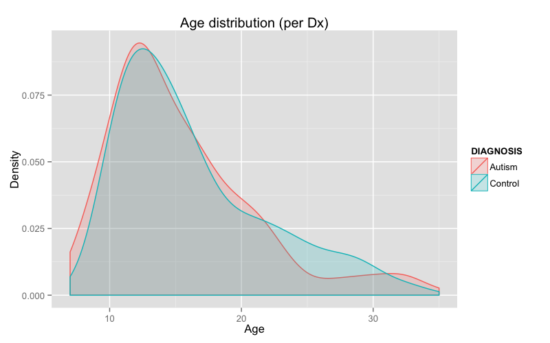
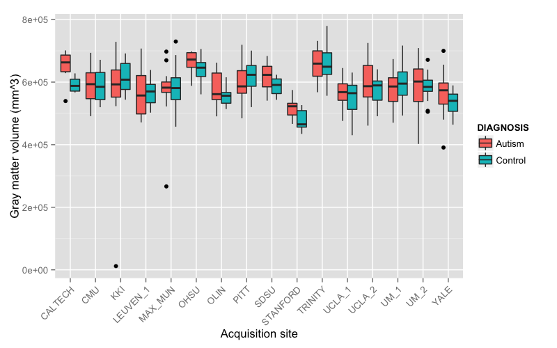
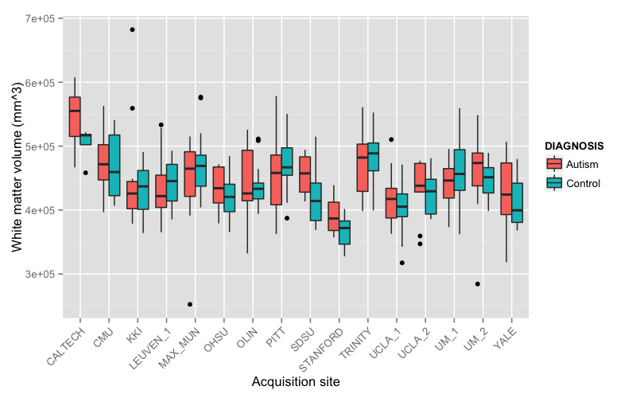
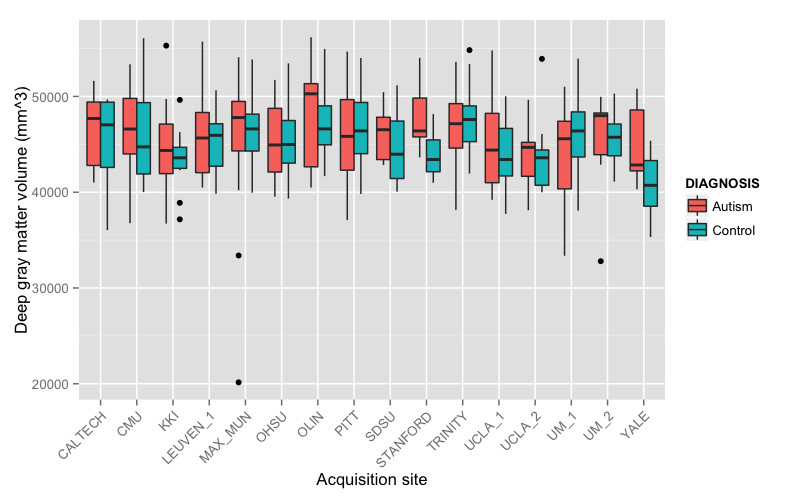

# Demographics

## Preprocessing:  subset and matching

```{r,results = 'asis', echo = T}
results <- read.csv( './Data/labelresultsAnts.csv' )
resultsSubset <- results[which( results$gender == 1 & results$age >= 6 & results$age <= 35 & results$handedness == 'R' ),]
drops <- c( "area.5th.ventricle", "area.left.lesion", "area.right.lesion", "area.left.vessel", "area.right.vessel", "area.optic.chiasm",
"volume.5th.ventricle", "volume.left.lesion", "volume.right.lesion", "volume.left.vessel", "volume.right.vessel", "volume.optic.chiasm" )
resultsSubset <- resultsSubset[, !( names( resultsSubset ) %in% drops )]

# match the data based on age and fiq
library( MatchIt )

resultsDf <- data.frame( subject.id = resultsSubset$subject.id,
                         dx.group = resultsSubset$dx.group,
                         age = resultsSubset$age,
                         fiq = resultsSubset$fiq
                       )
resultsDf$dx.group <- as.numeric( resultsDf$dx.group ) - 1
resultsDf <- na.omit( resultsDf )
resultsDf <- match.data( matchit( dx.group ~ age + fiq, data = resultsDf, method = "nearest", discard = "both" ) )

resultsMatched <- resultsSubset[which( is.element( resultsSubset$subject.id, resultsDf$subject.id ) ), ]
write.csv( resultsMatched, './Data/labelresultsANTsSubset.csv', quote = FALSE, row.names = FALSE )
```

## All sites

```{r,results = 'asis', echo = F}
results <- read.csv( './Data/labelresultsAntsSubset.csv' )

numberOfStudies <- nrow( results )
numberOfMales <- length( which( results$gender == 1 ) )
numberOfFemales <- length( which( results$gender == 2 ) )
numberOfAutism <- length( which( results$dx.group == 'Autism' ) )
numberOfControls <- length( which( results$dx.group == 'Control' ) )
numberOfRights <- length( which( results$handedness == 'R' ) )
numberOfLefts <- length( which( results$handedness == 'L' ) )
numberOfAmbis <- length( which( results$handedness == 'Ambi' ) )

cat( "Total number of studies = ", numberOfStudies, "\n\n", sep = '' )
cat( "   males = ", numberOfMales, ", females = ", numberOfFemales, "\n\n", sep = '' )
cat( "  autism = ", numberOfAutism, ", controls = ", numberOfControls, "\n\n", sep = '' )
cat( "  rights = ", numberOfRights, ", lefts = ", numberOfLefts, ", ambis = ", numberOfAmbis, "\n\n", sep = '' )
```

## Age distribution

```{r,results = 'asis', echo = F}
library( ggplot2 )

results <- read.csv( './Data/labelresultsAntsSubset.csv' )

ageDiagnosisDf <- data.frame( AGE = results$age, DIAGNOSIS = results$dx.group )

png( filename = "./Figures/ageDistribution.png", width = 8, height = 5, units = "in", res = 100 )
diagnosisPlot <- ggplot( ageDiagnosisDf, aes( AGE, ..density.., colour = DIAGNOSIS, fill = DIAGNOSIS ) ) +
labs( x = "Age", y = "Density", title = "Age distribution (per Dx)" ) +
geom_density( alpha = 0.2 )
print( diagnosisPlot )
x <- dev.off()
```



# Gross results


## Brain volume distribution

```{r,results = 'asis', echo = F}
library( ggplot2 )

results <- read.csv( './Data/labelresultsAntsSubset.csv' )

tivDiagnosisDf <- data.frame( TIV = results$total.volume, DIAGNOSIS = results$dx.group )

png( filename = "./Figures/tivDistribution.png", width = 8, height = 5, units = "in", res = 100 )
diagnosisPlot <- ggplot( tivDiagnosisDf, aes( TIV, ..density.., colour = DIAGNOSIS, fill = DIAGNOSIS ) ) +
labs( x = "Volume (mm^3)", y = "Density", title = "Intracranial volume (per Dx)" ) +
geom_density( alpha = 0.2 )
print( diagnosisPlot )
x <- dev.off()
```


## CSF volume distribution

```{r,results = 'asis', echo = F}
library( ggplot2 )

results <- read.csv( './Data/labelresultsAntsSubset.csv' )

csfDiagnosisDf <- data.frame( CSF = results$csf.volume, DIAGNOSIS = results$dx.group )

png( filename = "./Figures/csfDistribution.png", width = 8, height = 5, units = "in", res = 100 )
diagnosisPlot <- ggplot( csfDiagnosisDf, aes( CSF, ..density.., colour = DIAGNOSIS, fill = DIAGNOSIS ) ) +
labs( x = "Volume (mm^3)", y = "Density", title = "CSF volume (per Dx)" ) +
geom_density( alpha = 0.2 )
print( diagnosisPlot )
x <- dev.off()
```


## Gray matter volume distribution

```{r,results = 'asis', echo = F}
library( ggplot2 )

results <- read.csv( './Data/labelresultsAntsSubset.csv' )

gmDiagnosisDf <- data.frame( GM = results$gray.matter.volume, DIAGNOSIS = results$dx.group )

png( filename = "./Figures/gmDistribution.png", width = 8, height = 5, units = "in", res = 100 )
diagnosisPlot <- ggplot( gmDiagnosisDf, aes( GM, ..density.., colour = DIAGNOSIS, fill = DIAGNOSIS ) ) +
labs( x = "Volume (mm^3)", y = "Density", title = "Gray matter volume (per Dx)" ) +
geom_density( alpha = 0.2 )
print( diagnosisPlot )
x <- dev.off()
```


## White matter volume distribution

```{r,results = 'asis', echo = F}
library( ggplot2 )

results <- read.csv( './Data/labelresultsAntsSubset.csv' )

wmDiagnosisDf <- data.frame( WM = results$white.matter.volume, DIAGNOSIS = results$dx.group )

png( filename = "./Figures/wmDistribution.png", width = 8, height = 5, units = "in", res = 100 )
diagnosisPlot <- ggplot( wmDiagnosisDf, aes( WM, ..density.., colour = DIAGNOSIS, fill = DIAGNOSIS ) ) +
labs( x = "Volume (mm^3)", y = "Density", title = "Gray matter volume (per Dx)" ) +
geom_density( alpha = 0.2 )
print( diagnosisPlot )
x <- dev.off()
```


## Deep gray matter volume distribution

```{r,results = 'asis', echo = F}
library( ggplot2 )

results <- read.csv( './Data/labelresultsAntsSubset.csv' )

dgmDiagnosisDf <- data.frame( DGM = results$deep.gray.matter.volume, DIAGNOSIS = results$dx.group )

png( filename = "./Figures/dgmDistribution.png", width = 8, height = 5, units = "in", res = 100 )
diagnosisPlot <- ggplot( dgmDiagnosisDf, aes( DGM, ..density.., colour = DIAGNOSIS, fill = DIAGNOSIS ) ) +
labs( x = "Volume (mm^3)", y = "Density", title = "Deep gray matter volume (per Dx)" ) +
geom_density( alpha = 0.2 )
print( diagnosisPlot )
x <- dev.off()
```


## Total mean thickness distribution

```{r,results = 'asis', echo = F}
library( ggplot2 )

results <- read.csv( './Data/labelresultsAntsSubset.csv' )

thickDiagnosisDf <- data.frame( THICKNESS = results$total.mean.thickness, DIAGNOSIS = results$dx.group )

png( filename = "./Figures/totalMeanThicknessDistribution.png", width = 8, height = 5, units = "in", res = 100 )
diagnosisPlot <- ggplot( thickDiagnosisDf, aes( THICKNESS, ..density.., colour = DIAGNOSIS, fill = DIAGNOSIS ) ) +
labs( x = "Thickness (mm)", y = "Density", title = "Total mean thickness (per Dx)" ) +
geom_density( alpha = 0.2 )
print( diagnosisPlot )
x <- dev.off()
```


# Per site demographics

## Site demographics

```{r,results = 'asis', echo = F}
results <- read.csv( './Data/labelresultsAntsSubset.csv' )

numberOfStudies <- nrow( results )

count <- 0
for( q in levels( results$site ) )
  {
  count <- count + 1
  if( count <= 10 )
    {
    resultsSite <- results[which( results$site == q ),]
    cat( "  \n  ", q, ": n = " , nrow( resultsSite ), sep = '' )
    numberOfMales <- length( which( resultsSite$gender == 1 ) )
    numberOfFemales <- length( which( resultsSite$gender == 2 ) )
    cat( " (males = ", numberOfMales, ", females = ", numberOfFemales, ")", sep = '' )
    }
  }

```

## Site demographics (continued)

```{r,results = 'asis', echo = F}
results <- read.csv( './Data/labelresultsAntsSubset.csv' )

numberOfStudies <- nrow( results )

count <- 0
for( q in levels( results$site ) )
  {
  count <- count + 1
  if( count > 10 )
    {
    resultsSite <- results[which( results$site == q ),]
    cat( "  \n  ", q, ": n = " , nrow( resultsSite ), sep = '' )
    numberOfMales <- length( which( resultsSite$gender == 1 ) )
    numberOfFemales <- length( which( resultsSite$gender == 2 ) )
    cat( " (males = ", numberOfMales, ", females = ", numberOfFemales, ")", sep = '' )
    }
  }

```

## Age

```{r,results = 'asis', echo = F}
library( ggplot2 )

results <- read.csv( './Data/labelresultsAntsSubset.csv' )

ageDiagnosisDf <- data.frame( AGE = results$age, DIAGNOSIS = results$dx.group, SITE = results$site )

png( filename = "./Figures/siteAgeDistribution.png", width = 8, height = 5, units = "in", res = 100 )
diagnosisBoxPlot <- ggplot( ageDiagnosisDf, aes( x = SITE, y = AGE ) ) +
geom_boxplot( aes( fill = DIAGNOSIS ) ) +
scale_x_discrete( "Acquisition site", labels = levels( results$site ) ) +
scale_y_continuous( "Age" ) +
theme( axis.text.x = element_text( angle = 45, hjust = 1 ) )
print( diagnosisBoxPlot )
x <- dev.off()
```


# Per site gross results

## Brain volume

```{r,results = 'asis', echo = F}
library( ggplot2 )

results <- read.csv( './Data/labelresultsAntsSubset.csv' )

tivDiagnosisDf <- data.frame( TIV = results$total.volume, DIAGNOSIS = results$dx.group, SITE = results$site )

png( filename = "./Figures/siteVolumeDistribution.png", width = 8, height = 5, units = "in", res = 100 )
diagnosisBoxPlot <- ggplot( tivDiagnosisDf, aes( x = SITE, y = TIV ) ) +
geom_boxplot( aes( fill = DIAGNOSIS ) ) +
scale_x_discrete( "Acquisition site", labels = levels( results$site ) ) +
scale_y_continuous( "Brain volume (mm^3)" ) +
theme( axis.text.x = element_text( angle = 45, hjust = 1 ) )
print( diagnosisBoxPlot )
x <- dev.off()
```


## CSF volume

```{r,results = 'asis', echo = F}
library( ggplot2 )

results <- read.csv( './Data/labelresultsAntsSubset.csv' )

csfDiagnosisDf <- data.frame( CSF = results$csf.volume, DIAGNOSIS = results$dx.group, SITE = results$site )

png( filename = "./Figures/siteCsfVolumeDistribution.png", width = 8, height = 5, units = "in", res = 100 )
diagnosisBoxPlot <- ggplot( csfDiagnosisDf, aes( x = SITE, y = CSF ) ) +
geom_boxplot( aes( fill = DIAGNOSIS ) ) +
scale_x_discrete( "Acquisition site", labels = levels( results$site ) ) +
scale_y_continuous( "Csf volume (mm^3)" ) +
theme( axis.text.x = element_text( angle = 45, hjust = 1 ) )
print( diagnosisBoxPlot )
x <- dev.off()
```


## Gray matter volume

```{r,results = 'asis', echo = F}
library( ggplot2 )

results <- read.csv( './Data/labelresultsAntsSubset.csv' )

gmDiagnosisDf <- data.frame( GM = results$gray.matter.volume, DIAGNOSIS = results$dx.group, SITE = results$site )

png( filename = "./Figures/siteGmVolumeDistribution.png", width = 8, height = 5, units = "in", res = 100 )
diagnosisBoxPlot <- ggplot( gmDiagnosisDf, aes( x = SITE, y = GM ) ) +
geom_boxplot( aes( fill = DIAGNOSIS ) ) +
scale_x_discrete( "Acquisition site", labels = levels( results$site ) ) +
scale_y_continuous( "Gray matter volume (mm^3)" ) +
theme( axis.text.x = element_text( angle = 45, hjust = 1 ) )
print( diagnosisBoxPlot )
x <- dev.off()
```



## White matter volume

```{r,results = 'asis', echo = F}
library( ggplot2 )

results <- read.csv( './Data/labelresultsAntsSubset.csv' )

wmDiagnosisDf <- data.frame( WM = results$white.matter.volume, DIAGNOSIS = results$dx.group, SITE = results$site )

png( filename = "./Figures/siteWmVolumeDistribution.png", width = 8, height = 5, units = "in", res = 100 )
diagnosisBoxPlot <- ggplot( wmDiagnosisDf, aes( x = SITE, y = WM ) ) +
geom_boxplot( aes( fill = DIAGNOSIS ) ) +
scale_x_discrete( "Acquisition site", labels = levels( results$site ) ) +
scale_y_continuous( "White matter volume (mm^3)" ) +
theme( axis.text.x = element_text( angle = 45, hjust = 1 ) )
print( diagnosisBoxPlot )
x <- dev.off()
```



## Deep gray matter volume

```{r,results = 'asis', echo = F}
library( ggplot2 )

results <- read.csv( './Data/labelresultsAntsSubset.csv' )

dgmDiagnosisDf <- data.frame( DGM = results$deep.gray.matter.volume, DIAGNOSIS = results$dx.group, SITE = results$site )

png( filename = "./Figures/siteDgmVolumeDistribution.png", width = 8, height = 5, units = "in", res = 100 )
diagnosisBoxPlot <- ggplot( dgmDiagnosisDf, aes( x = SITE, y = DGM ) ) +
geom_boxplot( aes( fill = DIAGNOSIS ) ) +
scale_x_discrete( "Acquisition site", labels = levels( results$site ) ) +
scale_y_continuous( "Deep gray matter volume (mm^3)" ) +
theme( axis.text.x = element_text( angle = 45, hjust = 1 ) )
print( diagnosisBoxPlot )
x <- dev.off()
```



## Total mean thickness

```{r,results = 'asis', echo = F}
library( ggplot2 )

results <- read.csv( './Data/labelresultsAntsSubset.csv' )

thDiagnosisDf <- data.frame( TH = results$total.mean.thickness, DIAGNOSIS = results$dx.group, SITE = results$site )

png( filename = "./Figures/siteThVolumeDistribution.png", width = 8, height = 5, units = "in", res = 100 )
diagnosisBoxPlot <- ggplot( thDiagnosisDf, aes( x = SITE, y = TH ) ) +
geom_boxplot( aes( fill = DIAGNOSIS ) ) +
scale_x_discrete( "Acquisition site", labels = levels( results$site ) ) +
scale_y_continuous( "Total mean thickness (mm)" ) +
theme( axis.text.x = element_text( angle = 45, hjust = 1 ) )
print( diagnosisBoxPlot )
x <- dev.off()
```


# Paper results

## Results:  Intracranial volume

```{r,results = 'asis', echo = T}
library( xtable )
results <- read.csv( './Data/labelresultsAntsSubset.csv' )
fit <- aov( total.volume ~ dx.group + site + age + fiq, data = results )
print( xtable( anova( fit ) ), type = "html" )
```
